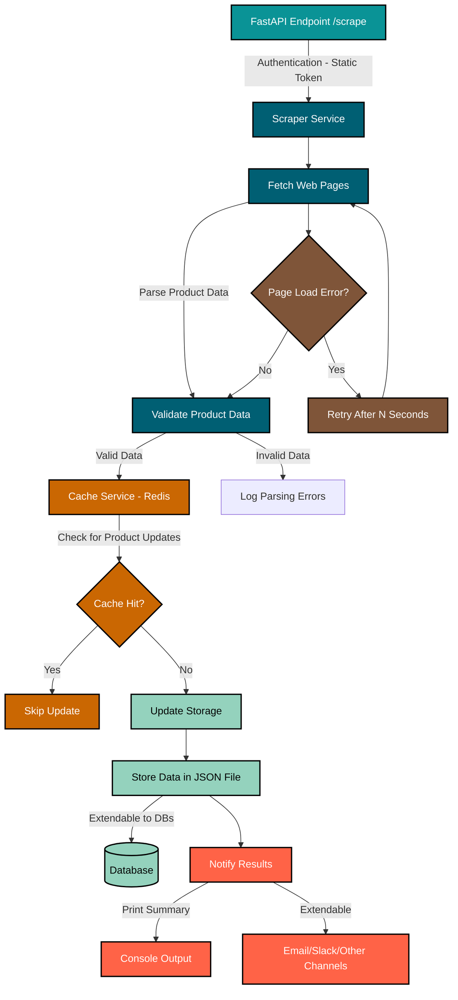

# Web Scraper 

## Overview

This project implements a web scraper service designed to extract product data from a paginated e-commerce website. The scraper uses **Selenium** for handling JavaScript-rendered content and **BeautifulSoup** for parsing the HTML. It incorporates retry logic to handle failures during page fetching and product data extraction.

## Features

- **Headless Web Scraping**: Uses Selenium and BeautifulSoup for dynamic content handling and HTML parsing.
- **Retry Logic**: Configurable retry mechanism for page loading and data extraction.
- **Product Data Extraction**: Extracts product name, price, link, and image URL.
- **Logging**: Tracks progress and errors for debugging and monitoring.

## Technologies Used

- **Selenium** for web scraping and dynamic content rendering.
- **BeautifulSoup** for parsing HTML.
- **Python** as the programming language.

## HLD:

